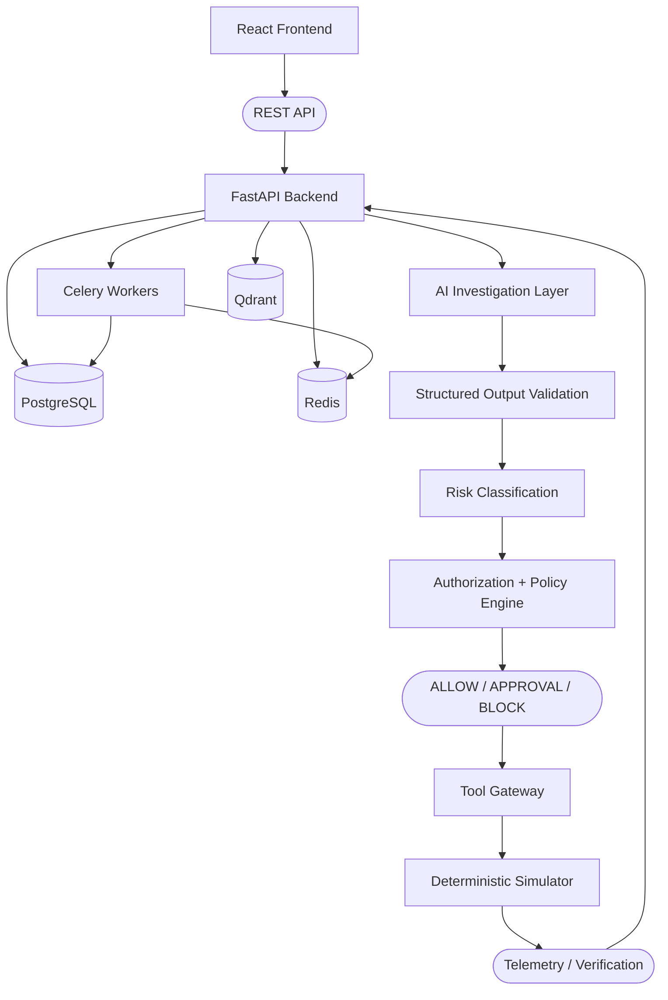
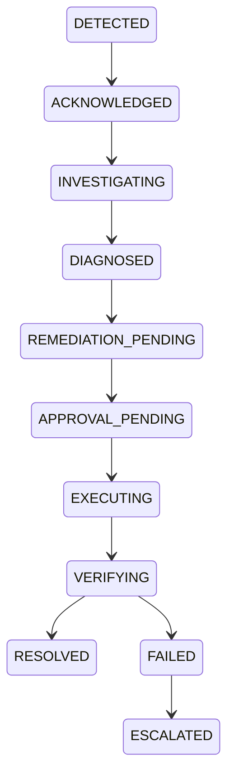

# OpsPilot

> AI-powered incident intelligence and controlled/autonomous remediation platform.

[](https://github.com/shivamjha10k/OpsPilot/actions/workflows/ci.yml)
[](https://www.python.org/downloads/release/python-3120/)

## What is OpsPilot?

Operational incidents require a complex lifecycle of detection, investigation, evidence gathering, safe remediation, verification, and auditability. OpsPilot is an end-to-end incident intelligence system that demonstrates this workflow within a deterministic, safe simulator. It bridges the gap between AI-driven operational insights and safe, controlled infrastructure execution.

## Why This Project is Interesting

OpsPilot was designed to explore safe, autonomous operations engineering. Key concepts demonstrated include:
- **AI-assisted incident investigation** using structured operational data.
- **RAG (Retrieval-Augmented Generation)** for contextualizing knowledge from runbooks.
- **Controlled tool execution** via a strict Tool Gateway.
- **Deterministic policy enforcement** and human-in-the-loop approval.
- **Verification and auditability** for every executed action.
- **Asynchronous orchestration** using Celery and Redis.
- **PostgreSQL** as the authoritative source of truth.

## Architecture

OpsPilot is built as a modular backend architecture with asynchronous Celery workers and isolated infrastructure services:



## Incident Lifecycle

OpsPilot tracks incidents through a rigorous lifecycle state machine:



## AI + RAG Investigation

When an incident is detected, OpsPilot begins a structured investigation:

`Incident → Context Builder → Read-only tools → AI provider → Structured/Evidence validation → Risk validation → Recommendation`

Qdrant acts as a derived semantic index for fast similarity search across runbooks and historical incident knowledge. However, PostgreSQL strictly remains the source of truth. Retrieved knowledge is explicitly treated as untrusted reference data, and all citations are validated before persistence to prevent hallucinations from polluting the operational record.

## Safety and Security

OpsPilot treats the LLM as an untrusted intelligence source. The LLM **never** directly executes infrastructure commands.

**Execution Boundary:**
1. **LLM Recommendation**
2. **Structured Validation**: Ensures the proposed tool and parameters match schema definitions.
3. **Risk Classification**: The Tool Gateway determines the authoritative risk of the action.
4. **Authorization & Policy Engine**: Evaluates RBAC and deterministic policies.
   - `CRITICAL` actions are denied.
   - `HIGH`-risk actions require human approval according to policy.
   - Self-approval is forbidden.
5. **Tool Gateway**: The sole bounded execution mechanism.
6. **Verification**: Post-execution validation of infrastructure metrics.

## Core Design Principle

OpsPilot separates **intelligence from authority**.

The AI system can investigate incidents, retrieve operational knowledge, generate hypotheses, and recommend actions. It does not receive direct authority to execute infrastructure changes.

Execution authority remains deterministic and is enforced through structured validation, risk classification, authorization, policy evaluation, the Tool Gateway, and post-action verification.

## Benchmark Results

OpsPilot's performance is rigorously measured against a simulated baseline. In a **120-trial simulated benchmark** across six diverse scenarios (`high_cpu`, `error_spike`, `db_connection_exhaustion`, `queue_backlog`, `memory_leak`, `failed_deployment`), OpsPilot achieved the following results:

| Metric | Simulated Baseline | OpsPilot |
|--------|--------------------|----------|
| Total Trials | 60 | 60 |
| Failures/Timeouts | 0 | 0 |
| Root-Cause Accuracy | - | 100% |
| Recommendation Accuracy | - | 100% |
| RAG Retrieval/Citation Coverage | - | 100% |
| Unsafe-Action Rate | 0% | 0% |
| HIGH-Risk Approval Enforcement | 100% | 100% |
| Mean MTTD (Detection) | 0.0038s | 0.0039s |
| Mean MTTI (Investigation) | Not Measured | 0.292s |
| Mean MTTR (Resolution) | 0.437s | 0.417s |

> **Interpretation:** Overall remediation execution was 50% because HIGH-risk scenarios were correctly held for human approval. These cases are policy-enforced non-executions, not failed remediation attempts.

## Testing and CI

The repository is validated by four GitHub Actions CI checks covering backend tests, benchmark evaluation, frontend validation, and Docker Compose configuration.

For more details, see the [Testing Documentation](docs/testing/README.md).

## Tech Stack

- **Backend**: Python 3.12, FastAPI, SQLAlchemy, Pydantic, Alembic
- **Data/Infrastructure**: PostgreSQL 16, Redis 7, Celery, Docker Compose
- **AI/RAG**: Qdrant, Semantic Embeddings
- **Frontend**: React 18, TypeScript, Vite
- **Testing/CI**: Pytest, GitHub Actions

## Repository Structure

```text
OpsPilot/
├── backend/            # FastAPI application and Celery workers
│   ├── app/            # Domain logic, AI, Policies, Gateway, Simulator
│   ├── tests/          # Unit, integration, and security test suites
│   └── alembic/        # Database migrations
├── frontend/           # React operations console
├── docs/               # Architecture, operations, testing, and benchmarks
├── performance/        # Load and dependency testing harness
├── scripts/            # Development seeds and benchmark CLI
├── .github/workflows/  # CI pipelines
└── docker-compose.yml  # Local infrastructure definitions
```

## Run Locally

OpsPilot can be run entirely locally using Docker Compose.

1. Configure environment variables:
   ```bash
   cp .env.example .env
   ```
   *(Update placeholders in `.env`. Never commit secrets.)*

2. Start the infrastructure:
   ```bash
   docker compose up --build
   ```

3. Run the development database seed:
   ```bash
   docker compose run --rm --no-deps backend alembic upgrade head
   docker compose run --rm --no-deps backend python /opt/opspilot-scripts/seed_dev.py
   ```

The backend API is available at `http://localhost:8000` and the frontend console at `http://localhost:5173`.

## Documentation

- [Architecture Guide](architecture.md)
- [Security Model](SECURITY.md)
- [Demo Flow](docs/demo.md)
- [Testing Matrix](docs/testing/final-test-matrix.md)
- [Benchmark Methodology](docs/benchmarks/benchmark-methodology.md)
- [Operations Runbook](docs/operations/runbook.md)
- [Final Readiness Report](docs/operations/final-readiness-report.md)

## Current Scope / Limitations

- **Simulated Infrastructure**: OpsPilot is evaluated against an internal deterministic simulator. It does not perform production infrastructure automation.
- **Deterministic AI**: A deterministic `MockAIProvider` is used by default for testing and local execution predictability.
- **Authentication**: JWTs are utilized, but programmatic revocation (blacklisting) prior to token expiration is not currently implemented.
- **Infrastructure Latency**: Redis and Celery reconnect mechanisms may cause transient latency spikes in container-dense environments.
- **Capacity**: No claims are made regarding production deployment scale or capacity.

## Project Status

OpsPilot is feature-complete for its defined, controlled simulator and demo scope, heavily validated by continuous integration. It serves as a comprehensive proof-of-concept for safe AI operations, though it is explicitly not intended for drop-in production readiness.
